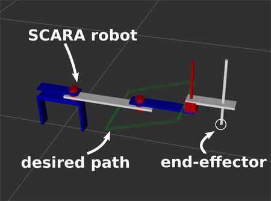
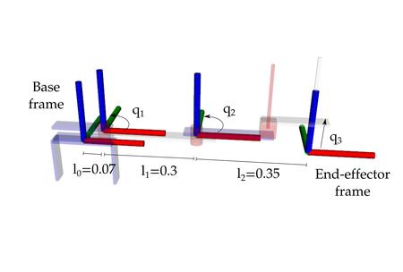
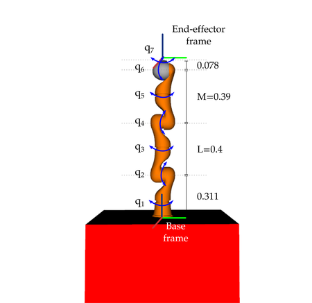

# Inverse Kinematics

## Second assignment: Inverse Kinematics
In this assignment you will program the inverse kinematic (IK) algorithm for a robot, which will move its joints so that it follows a desired path with the end-effector. 

It is composed of two parts:
1. A 3 DOF SCARA robot, with an inverse kinematic solution that is possible in analytic form. Solving this part is the minimum requirement to pass the assignment, and get an E grade. Kattis will give you a score of 20 or above if this part is solved.
2. A 7 DOF KUKA robot, with the inverse kinematic solution to be implemented with iterative algorithms. Solving this part is required for a C grade (the best grade possible for this assignment). Kattis will give you a score of 22 if both parts are solved.

Download the file *Assignment_2_kinematics.zip* from [here](https://github.com/Xiaojing-Tan/DD2410-HT23/raw/main/Assignment2/2023_Assignment_2_kinematics.zip) and decompress it. Put the ROS package in your ROS workspace and run `catkin_make`. Remember to source the `devel/setup.bash` file if needed.

The python file: *kinematics_assignment_metapackage/kinematics_assignment/scripts/IK_functions.py* is the file you have to modify and submit to pass the assignment. This file contains two functions, one per robot.

## **PART 1: SCARA ROBOT**
To visualize the robot, run:

`roslaunch kinematics_assignment scara_launch.launch`

An rviz window will open:

This allows you to visualize the robot and verify that it moves correctly along the desired path once you have implemented the IK solution.

The following image shows the distances between the joints and the end-effector frame, in the robot's zero configuration. Two joints (q1 and q2) are revolute, and one (q3) is prismatic. Notice that the end-effector frame and the base frame are at the same height, which means that the end-effector z coordinate coincides with the value of the last prismatic joint (q3).

Your task is to fill the function *scara_IK* in the *IK_functions.py* file so that it returns the correct joint values to follow the given path. More specifically, this function receives as **input the desired point = (x, y, z)**, and **outputs** the corresponding **joint values q = (q1, q2, q3)**. 

At the beginning, this function always returns zero values for the joints, so the robot will not move. Once you have obtained an analytical solution for the inverse kinematics, you can check if the robot correctly follows the desired path. To do so, you can relaunch the *scara_launch.launch* file or, if it is already running, you can restart the path following by calling: `rosservice call /restart`.

The robot's joints will start moving according to the solution you provide, and you should see something like this:

https://github.com/Xiaojing-Tan/DD2410-HT23/assets/58906870/77e1b161-4434-459f-941c-ddd8c35bd382

(Source: https://www.youtube.com/watch?v=rsxZDhXIY-Q&t=1s)

Since there is more than one possible solution for this IK problem, the motion of your robot could look different. The important aspect is that the end-effector is following the desired path.

## **PART 2: KUKA ROBOT**
To visualize the robot, run:

`roslaunch kinematics_assignment kuka_launch.launch`

An rviz window will open:

This robot has a kinematics structure much more complex than the SCARA, therefore it is not feasible to obtain an analytic solution for the inverse kinematics problem.

Your task is to fill the function *kuka_IK* in the *IK_functions.py* file so that it returns correct joint values. The inputs to this function are: 

- point = (x, y, z), the desired position of the end-effector.
- R = 3x3 rotation matrix, the desired orientation of the end-effector.
- joint_positions = (q1, q2, q3, q4, q5, q5, q7) the current joint positions.

The output of this function is a vector q containing the 7 joint values that give the desired pose of the end-effector. 

At the beginning, this function always outputs the inputted joint positions, so the robot does not move.

To help you write the IK algorithm, this is the DH table of the KUKA robot, with the depicted frames:

The DH table follows this convention:

- $a_i$ distance between $z_{i-1}$ and $z_i$ along the axis $x_i$
- $\alpha_i$ angle between $z_{i-1}$ and $z_i$ about the axis $x_i$
- $d_i$ distance between $x_{i-1}$ and $x_i$ along the axis $z_{i-1}$
- $\theta_i$ angle between $x_{i-1}$ and $x_i$ about the axis $z_{i-1}$

The frame transformation can be found as:

$^{i-1}T_i=\:Trans\left(z_{i-1},\:d_i\right)Rot\left(z_{i-1},\:\theta_i\right)Trans\left(x_i,\:a_i\right)Rot\left(x_i,\:\alpha_i\right)
$

For a solution to compute the robot's Jacobian, you can check the section "Jacobian computation" at page 111 in [this book](https://link.springer.com/book/10.1007/978-1-84628-642-1).

Once you have implemented an IK solution, you can test it by relaunching the *kuka_launch.launch* file or, if it is already running, by calling

`rosservice call /restart`. 

The robot should move down and up along the path, keeping a constant orientation, similarly to this:

https://github.com/Xiaojing-Tan/DD2410-HT23/assets/58906870/50302538-d79b-4f34-99da-06945fef1441

(Source: https://www.youtube.com/watch?v=A-MGo2cvHNs)

### FAQ:

1. One of the most common questions we get for this assignment is regarding the threshold for the KUKA part. Students often find that if they set the tolerance threshold for when to break the loop in the numerical IK too small, they get a time out, and when they set it too high, the error is too large. For all cases we have examined, this has never been caused by the range of acceptable values for the threshold being small. In all cases it has been caused by the implementation of the algorithm being incorrect, so that it doesn't converge. Thus, with a small threshold, the loop never exits, and with a large threshold, the loop never starts, as the initial error is already smaller than the threshold.

2. If the robot model does not appear on rviz try adding this line to your bashrc and source it again.

    `echo 'export LC_NUMERIC="en_US.UTF-8"' >>~/.bashrc`

    `source ~/.bashrc`

3. *Different values/python methods/libraries/equations work for me and my classmates, is there something wrong?* Not at all. It really depends on your individual implementation and that is why it is difficult for us to tell exactly why you may be exceeding the time limit or not getting all the points. We have seen every imaginable combination work.

4. *My robot is flailing like crazy all over the place.* Check you can follow positions first, then debug orientations.

5. *Kattis tells me my solution is "Accepted", and that my score is 10. Does this mean I passed the E level?* No. Kattis telling you that your solution is "Accepted" just means that it your code didn't crash or time out. The requirement for passing (E grade) is at least 20 points, and the requirement for C is to have 22 points. Thus, a score of 0, 1, 2, or 10 means that you did not yet pass. A score of 20 or 21 means that you passed the E level.
