# Mapping

## [PDF from the presentation](https://github.com/Xiaojing-Tan/DD2410-HT23/blob/main/Assignment4/IROB23%20-%20Assignment%204_%20Mapping.pdf){target="_blank"}

## Fourth assignment: Mapping
Mapping is one of the core competencies of truly autonomous robots. Autonomous robots can use maps in a number of different ways, search and rescue robots can use them to make sure they search through the whole building instead of moving in between the same rooms over and over, autonomous cars use them in order to find a path that leads to the desired location, multicopters can use the maps to localize themself in order to stay in the air.

In many situations we cannot assume that the robot can be given a map in advance. Even if there are maps available, such as blueprints for a building, they are not always useful for the robot and might be incorrect (too old, building collapsed, etc). Therefore it is of great benefit if the robot can construct a map by itself from scratch, which is exactly what we will do in this assignment.

## Occupancy grid mapping
Occupancy grid mapping is one of many mapping algorithms. Here the world is represented as a grid, where each cell of the grid corresponds to an area in the world. The value of the cell can tell us if the area is free, occupied, unknown, or something else (which you will see in the C-part of this assignment).

The occupancy grid is characterized by the number of cells and the resolution. More cells means that it is possible to map a larger area. In this assignment we will work with a 2D occupancy grid but 3D grid maps are often used as well. The resolution describes how big of an area each cell covers. If the resolution is 5cm then one cell in a 2D grid covers a 25cm² area.

## [Robot Operating System (ROS)](https://www.ros.org/)
For this assignment you will have to familiarize yourself with four ROS messages.

### [geometry_msgs/PoseStamped](http://docs.ros.org/noetic/api/geometry_msgs/html/msg/PoseStamped.html)
This message contains a [header](http://docs.ros.org/noetic/api/std_msgs/html/msg/Header.html) and a [pose](http://docs.ros.org/noetic/api/geometry_msgs/html/msg/Pose.html). You should ignore the header for this assignment, however it is of great use when working with ROS. The [pose](http://docs.ros.org/noetic/api/geometry_msgs/html/msg/Pose.html) contains - as expected - the [position](http://docs.ros.org/noetic/api/geometry_msgs/html/msg/Point.html) and the [orientation](http://docs.ros.org/noetic/api/geometry_msgs/html/msg/Quaternion.html) of the robot. The [orientation](http://docs.ros.org/noetic/api/geometry_msgs/html/msg/Quaternion.html) is represented in quaternion form. In this assignment you will use the pose to know where in the world the robot is located.

### [sensor_msgs/LaserScan](http://docs.ros.org/noetic/api/sensor_msgs/html/msg/LaserScan.html)
As the name suggest this message contains a laser scan. It also contains a [header](http://docs.ros.org/noetic/api/std_msgs/html/msg/Header.html) which you also should ignore for this assignment.

For the assignment you will have to use:

|**Argument**       |**Purpose**|
|---                |---        |
|angle_min          |Start angle of the scan in radians|
|angle_max	        |End angle of the scan in radians|
|angle_increment    |Angular distance between measurements in radians|
|range_min	        |Minimum range value in meter*|
|range_max	        |Maximum range value in meter*|
|ranges*	        |Range data in meter (values <= range_min or >= range_max should be discarded)|

The bearing for the first range in ranges (ranges[0]) is angle_min. The bearing for the second range in ranges (ranges[1]) is angle_min + angle_increment and so on. This way you can get both the bearing and the range.

*It should really be (values < range_min or > range_max should be discarded), but due to a small mistake in making the assignment it is now (values <= range_min or >= range_max should be discarded).

### [nav_msgs/OccupancyGrid](http://docs.ros.org/noetic/api/nav_msgs/html/msg/OccupancyGrid.html)
This message contains the actual occupancy grid. The map data is stored in data, in row-major order, starting with (0,0). As the above two, it also contains a [header](http://docs.ros.org/noetic/api/std_msgs/html/msg/Header.html) which you also should ignore for this assignment. The message also contains meta data for the map, in form of [nav_msgs/MapMetaData](http://docs.ros.org/noetic/api/nav_msgs/html/msg/MapMetaData.html).

In this assignment you will not be working directly with this message, instead we have created a class called GridMap which you can find in mapping_assignment_metapackage/mapping_assignment/scripts/grid_map.py that you will be working with.

### [map_msgs/OccupancyGridUpdate](http://docs.ros.org/jade/api/map_msgs/html/msg/OccupancyGridUpdate.html)
This message is only used in the C-part of the assignment.

As the name suggest this message contains an occupancy grid update. The reason for having this message is that when building a map, only a small portion (where the robot is) of the map is updated at each iteration. Therefore it is wasteful to send out the whole map each time it is updated, as with the nav_msgs/OccupancyGridLinks to an external site. message. Instead this message only contains a rectangle area where the map has been updated. The message contains:
|**Argument**   |**Purpose**|
|---            |---        |
|header         |You should ignore this|
|x	            |Starting x coordinate of the rectangle area (should be minimum x)|
|y              |Starting y coordinate of the rectangle area (should be minimum y)|
|width          |The width of the rectangle area|
|height	        |The height of the rectangle area|
|data	        |The actual map data for the rectangle area, in row-major order, starting with (x,y)|

### [Rosbag](http://wiki.ros.org/rosbag/Commandline)
For this assignment you are given a number of rosbags that we have recorded. A rosbag contains messages from different ROS topics that have been recorded at an earlier occasion. They are useful during development and for comparing different algorithms, since you get - almost - the exact same data every time you run the rosbag and you do not have to run a simulator or a real robot every time you want to test your code.

For this assignment you are given four rosbags, located in mapping_assignment_metapackage/mapping_assignment/bags/, which you should use when testing your code.

## Install
Download the ROS package from here Download [here](https://github.com/Xiaojing-Tan/DD2410-HT23/raw/main/Assignment4/assignment4_mapping.zip) in your ROS workspace and run catkin_make. Remember to source the devel/setup.bash if needed.

## To run your code
You have two options for how to run your code in this assignment, the first (using ROS) is highly recommended since you get to see in real time what your code is doing.

### Using ROS (from rosbag)
This approach is how you normally work with ROS. We have saved some rosbags, located in mapping_assignment_metapackage/mapping_assignment/bags/, that contain sensor data from a robot which has been moving in an unexplored area. Using this approach you will be able to see the robot in real time mapping the environment, which can help you when you are debugging.

For this you have to open four terminals:

Terminal 1: `roscore`  
A roscore has to be running for ROS nodes to be able to communicate with each other.  
It is good practice to start the roscore in a separate terminal, even though a roscore is automatically started when you use roslaunch (note that a roscore is not automatically started when you use rosrun). This is because you might have to restart the launch file that you started with roslaunch, this will cause the roscore to terminate and you have to restart everything.

Terminal 2: `roslaunch mapping_assignment play.launch`  
This launches RVIZ for you so that you can see how the robot moves and how the map is being updated by your code.

Terminal 3: `rosbag play --clock BAGFILE`  
Where:
|**Argument**   |**Purpose**|
|---            |---        |
|--clock        |Publish the clock time. This is to make sure that the time from the BAGFILE is published. Otherwise, the robot in RVIZ will not reset if you restart the bag.|
|BADFILE        |Path to a rosbag, which are located here *mapping_assignment_metapackage/mapping_assignment/bags/*|

This starts the rosbag which contains the robot's position and the sensor readings from the robot.

Terminal 4: `rosrun mapping_assignment main.py`  
This runs your code.

**NOTE:** If you restart the rosbag you should also restart this, since the map is never deleted otherwise between different runs.

### From text file generated from rosbag
This approach is only available to facilitate you when you want to compare the map your code generate compared to the maps that we have supplied. We highly recommend to use the other approach for most of the development.

Terminal 1: `roscore`  
Same as above.

Terminal 2: `rosrun mapping_assignment main.py FILE`  
Where:
|**Argument**   |**Purpose**|
|---            |---        |
|FILE           |Is the file you want to run. You can run `rosrun mapping_assignment main.py -h` to see which files are available.|

This runs your code using data from a text file that we have provided. Once finished it will save the map(s) to *mapping_assignment_metapackage/mapping_assignment/maps/FILE/* in form of image file(s). If you attempt on doing the C-part of the assignment two maps will be saved (one of the "normal" map and one of the inflated map, explained later), otherwise only one (the "normal" map) will be saved.

## PART 1: E assignment
The python file *mapping_assignment_metapackage/mapping_assignment/scripts/mapping.py* is the file you have to modify and submit to pass the assignment.

To get an E on this assignment you have to fill in the *update_map(self, grid_map, pose, scan)* function. You should **not** fill in the *update = OccupancyGridUpdate()* found at the bottom of the function for this assignment.

In the *update_map(self, grid_map, pose, scan)* function you get the current map, *grid_map*, the current *pose* of the robot and the latest laser *scan*. Using the *pose* and *scan* you should updated *grid_map*. You can use the function *add_to_map(self, grid_map, x, y, value)* to add *value* to *grid_map* at index (x,y). It is recommended that you use this method since it does bounds and value checking for you.

What you have to do:
1. Convert the laser scan ranges and bearings to coordinates in the laser frame
2. Convert the coordinates to the map frame
3. Convert the coordinates to map indices (***Hint***: Use [*int(X)*](https://docs.python.org/2/library/functions.html#int) to convert from float to int, do not use [*round(X)*](https://docs.python.org/2/library/functions.html#round)).
4. Fill in the occupied cells
5. Check against the maps output you are given to compare against and when they match you can submit to Kattis and hopefully receive an E.

Below in the table you will find an image for each of the four maps. This is how your corresponding map should look if you have done the assignment correctly. You can find images of all correct maps in the folder *mapping_assignment_metapackage/mapping_assignment/correct_maps/*.
|**Map**    |**Image**|
|---        |---|
|stage_1    |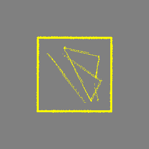|
|stage_2    |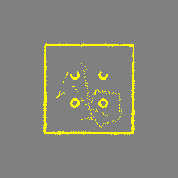|
|stage_3    |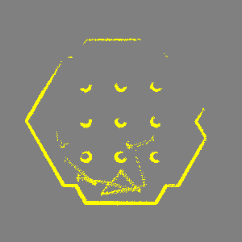|
|stage_4    |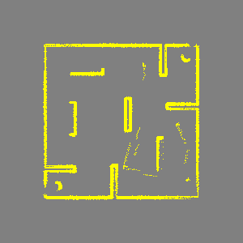|

The yellow part of the images is occupied space, while the gray part is unknown space.

## PART 2: C Assignment
The python file *mapping_assignment_metapackage/mapping_assignment/scripts/mapping.py* is the fill you have to modify and submit to pass the assignment.

To get an C on this assignment you have to fill in the *update_map(self, grid_map, pose, scan)* function. Now you should fill in the *update = OccupancyGridUpdate()* found at the bottom of the function for this assignment.

From the images in the table from PART 1 we can identify at least two problems with our maps. The first is that the maps are noisy, what do you think the cause of this is? The other problem is that we only know where occupied space (yellow) is, the rest is unknown (gray), which can be a problem if you for example want to do path planning. In the C assignment we will first of solve these two problem by clearing free space.

We know that the cells between the robot's position and the endpoints of the laser scan are free (the light was able to travel here). You should therefore use the supplied *raytrace(self, start, end)* function (do not implement your own function) to calculate these cells for each laser range reading and mark them as free space, using the *self.free_space* variable.

It is wasteful to update the whole map each time a new laser scan message arrives, since only a fraction of the map has to be updated. For this assignment you should therefore fill in the *update = OccupancyGridUpdate()* found at the bottom of the *update_map(self, grid_map, pose, scan)* function.

Before the robot uses the map for planning the grid map will typically be processed to create a so called C-space (configuration-space) map. This is done by expending each obstacle, i.e. each cell, in the map with a circle with the same radius as the robot. When this is done we can treat the robot as a point in all further calculations. This makes planning a lot faster because all we need to check to see if the robot can be at a certain location is to see if the cell is free or not, as apposed to having to check all cells that is covered by the robot body.

Lastely, 

What you have to do:

1. Clear free space between the scan endpoints and the robot's position, using *raytrace(self, start, end)* function and *self.free_space* variable.
2. Fill in occupied space as described in "PART 1: E assignment"
3. Fill in *update = OccupancyGridUpdate()* to only return the updated part of the map
4. Expand occupied space to create C-space in the *inflate_map(self, grid_map)* function, using *self.c_space* variable.

|**Map**    |**Image**|                     **Image inflated**|
|---        |---      |---|
|stage_1    |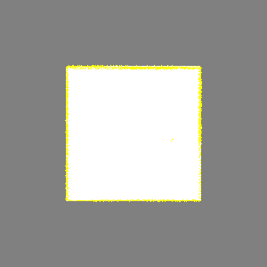|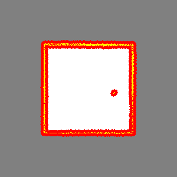|
|stage_2    |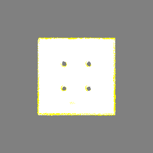|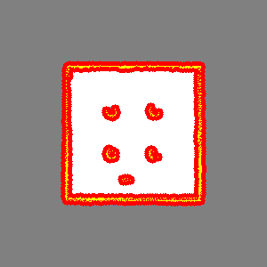|
|stage_3    |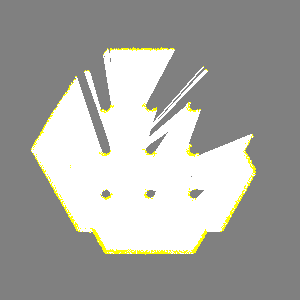|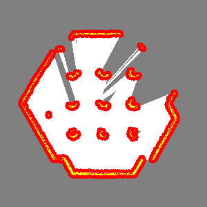|
|stage_4    |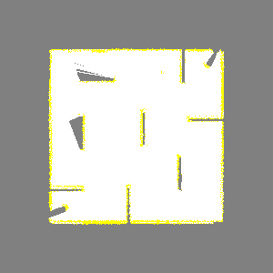|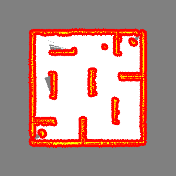|

The yellow part of the images is occupied space, the white free space, gray unknown space, and red C-space.

### Hints
- To check if you have done the update part of the C assignment you can use rostopic echo (you have to run from a rosbag to do this)
    - To see what you are publishing on that topic run:
        - `rostopic echo /map_updates`
    - To remove the array from the output add “--noarr” (no array), this makes it easier to read:
        - `rostopic echo /map_updates --noarr`
    - Check if the x, y, width, height, and array length seem reasonable
    - Remember that the data field of the update should only hold a 1D array
- The order in which you update the map is important. Be sure that you do not overwrite something you should not do
